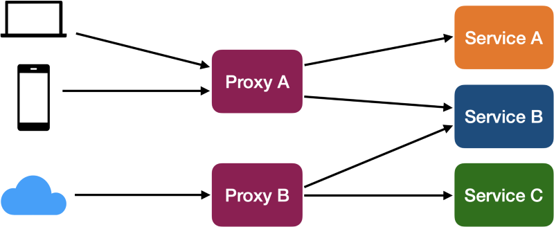

### Combine OpenAPI files

This repo was created as complement of this blogpost and illustrates this diagram.



### Getting Started

The proxies are in the folder [proxies](./proxies), while the apis are in [apis](./apis) folder. At the [package.json](./package.json), there are script commands to start each one of the servers separated or a single command to start all of them at once.

The APIs use [Poetry](https://python-poetry.org) as the dependency manager.

```bash
yarn # Installs both JS and Python dependencies
yarn start # Starts both Node and Django servers
```
